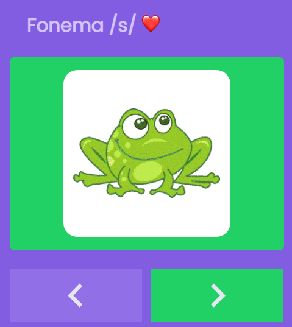

<h1 align="center">
    Phonemes - To practice the phoneme /s/
</h1>

## Project
[View the project](https://phonemes.vercel.app/)

  

## Motivations

My daughter needs to improve her words with the phoneme /s/. The speech therapist gave exercises and drawings for her to train this phoneme.
To make learning easier and to make the visualization of the figures more interesting, I created this little App for her.

## Running the Project

Run `npm start` to start the built-in web server at [http://localhost:3000](http://localhost:3000).

## Versions

This project was bootstrapped with [Create React App](https://github.com/facebook/create-react-app).

## Special thanks
Débora Klemz, speech therapist who designed this exercises

---
Made with ♥ by Me